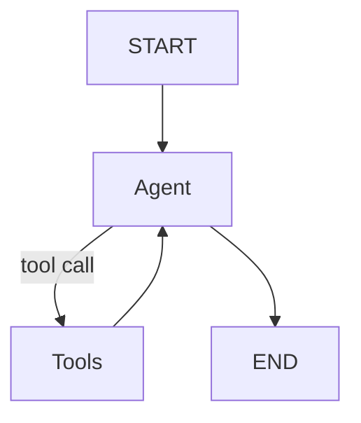

# AI Trip Planner

Agentic travel planner with a FastAPI backend, Streamlit frontend, LangGraph orchestration, and optional LangSmith tracing and alerting.

## What it does

- Accepts a user prompt for a trip plan.
- Uses a LangGraph agent with tools to collect weather, places, and cost info.
- Returns a structured plan in the UI.
- Supports Docker, ECR/ECS/App Runner deployment, and GitHub Actions CI/CD.

## Project structure

```
AI_Trip_Planner/
	main.py                      # FastAPI backend
	streamlit_app.py             # Streamlit UI
	agent/
		agentic_workflow.py        # LangGraph agent and tool wiring
	tools/                       # Tool definitions (weather, places, cost, FX)
	utils/
		model_loader.py            # LLM loader (Groq/OpenAI)
		langsmith_monitor.py       # LangSmith alerts (log/webhook/smtp)
	config/
		config.yaml                # Model selection
	Dockerfile
	docker-compose.yml
	deploy-aws.sh                # ECR + ECS deploy script
	ecs-task-definition.json     # ECS task template
	apprunner-config.json        # App Runner config
	.github/workflows/deploy.yml # GitHub Actions -> ECR
```

## How the agent is built

The agent is defined in [agent/agentic_workflow.py](agent/agentic_workflow.py):

- `GraphBuilder` loads the LLM via [utils/model_loader.py](utils/model_loader.py)
- Tools are registered from:
	- [tools/weather_info_tool.py](tools/weather_info_tool.py)
	- [tools/place_search_tool.py](tools/place_search_tool.py)
	- [tools/expense_calculator_tool.py](tools/expense_calculator_tool.py)
	- [tools/currency_conversion_tool.py](tools/currency_conversion_tool.py)
- The graph flow is:



`Agent` uses the system prompt from [prompt_library/prompt.py](prompt_library/prompt.py) and binds tools for function calls.

## Local run (no Docker)

1) Create and activate a virtual environment.
2) Install dependencies:

```bash
pip install -r requirements.txt
```

3) Create `.env` (do not commit secrets):

```
GROQ_API_KEY=...
TAVILAY_API_KEY=...
OPENWEATHERMAP_API_KEY=...
EXCHANGE_RATE_API_KEY=...
LANGCHAIN_TRACING_V2=true
LANGCHAIN_API_KEY=...
LANGCHAIN_PROJECT=AGENTIC-AI-LLMOPS
```

4) Run backend:

```bash
uvicorn main:app --reload --port 8000
```

5) Run frontend:

```bash
streamlit run streamlit_app.py
```

Backend: http://localhost:8000
Frontend: http://localhost:8501

## Docker

### Build and run with Docker Compose

```bash
docker-compose up --build
```

This builds one image and runs two services:
- `backend` on port 8000
- `frontend` on port 8501

### Standalone Docker build

```bash
docker build -t trip-planner:latest .
docker run -p 8000:8000 -p 8501:8501 trip-planner:latest
```

The image uses `supervisord` to run both FastAPI and Streamlit.

## AWS ECR + ECS (manual)

The script [deploy-aws.sh](deploy-aws.sh) builds and pushes to ECR, then registers an ECS task and creates a service.

1) Update `subnet-xxxxx` and `sg-xxxxx` in [deploy-aws.sh](deploy-aws.sh)
2) Update env vars in [ecs-task-definition.json](ecs-task-definition.json)
3) Run:

```bash
chmod +x deploy-aws.sh
./deploy-aws.sh
```

This creates:
- ECR repository `trip-planner`
- ECS cluster `trip-planner-cluster`
- ECS service `trip-planner-service`

## AWS App Runner (optional)

[apprunner-config.json](apprunner-config.json) defines a service that pulls the ECR image and exposes port 8501 (Streamlit). Update the runtime env vars before use.

## GitHub Actions (ECR push)

The workflow in [.github/workflows/deploy.yml](.github/workflows/deploy.yml) builds and pushes to ECR on every `main` push.

Required GitHub secrets:
- `AWS_ACCESS_KEY_ID`
- `AWS_SECRET_ACCESS_KEY`

The workflow tags the image as both `latest` and the commit SHA.

## Public availability

When ECS/App Runner is configured with public networking, the service becomes publicly accessible via the AWS-generated URL or load balancer. You must open the correct ports (8000 for backend, 8501 for frontend) and use a public subnet with `assignPublicIp=ENABLED`.

## Observability (LangSmith)

Tracing is enabled via `LANGCHAIN_TRACING_V2=true` and `LANGCHAIN_API_KEY` in `.env`. Alerts are handled in [utils/langsmith_monitor.py](utils/langsmith_monitor.py) with three modes:

- `log` (default, easiest)
- `webhook`
- `smtp`

Configure:

```
ALERT_NOTIFY_MODE=log
ALERT_LATENCY_SECONDS=5
ALERT_TOKEN_THRESHOLD=50
```

## Security notes

- Never commit `.env` or any API keys.
- Use GitHub secrets or AWS Secrets Manager for production.

## Troubleshooting

- If tools fail, check tool schemas and the LLM function-call output.
- If tracing is missing, verify `LANGCHAIN_API_KEY` and project name.